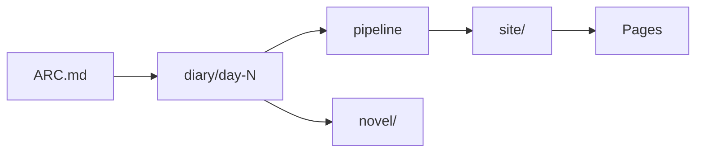

<p align="center">
  
</p>

<p align="center"><em>One question a night. One hundred answers. The life, written in public.</em></p>

# 100 Days of Non

**A 100-day biographical writing practice — one question per day, answered in public, checked against the record.**

[](LICENSE)
[](https://github.com/Nonarkara/100daysofnon)

By [Non Arkaraprasertkul](https://github.com/Nonarkara) (Nonarkara) — Axiom X Co., Ltd., Bangkok.

Independent studio writing. **Not** an official depa, municipal, university, or government biography.

ไทย–English readers are the intended audience. The public site switches language; this README is English so a learner landing from the [Nonarkara](https://github.com/Nonarkara) profile can fork the *method* without guessing.

---

## What this is

A civic-studio writing installation: **one hundred days**, **one question a day**, answers kept as diary files and assembled into a readable life. The tree on `main` holds:

- `docs/ARC.md` — the 100-question spine (nine phases, from origin to “what was this for”)
- `diary/day-001/` … `diary/day-100/` — question, answer, fact-check, narration, telemetry (and artifacts when they exist)
- `docs/METHOD.md` — how a day is supposed to run
- `site/` — static HTML surfaces generated from that record
- `novel/` — companion fiction grown from the same life (`The Convenience`; dual-timeline *Two Layers*)
- `pipeline/` — intake and analysis scripts
- `bot-worker/` — optional Cloudflare Worker that answers questions from the public corpus (keys live in Wrangler secrets, not git)

This is **writing practice in public**, not a city ranking and not a product demo. If you came here to learn how a one-Mac studio turns a life into pages, start with the diary and the method. If you came here for API keys, Telegram tokens, or a private OpenClaw config: they are not in this repository.

**This repo is not:**

- An official biography issued by a ministry, university, or municipality
- A black-box score, leaderboard, or “index” of a person
- A dump of bot tokens, Anthropic keys, or analytics IDs
- A claim that every companion surface is finished or that every day page is already generated (only some `site/day/` pages are in the tree)

Related public work from the same studio: [live-coding bible](https://github.com/Nonarkara/live-coding-bible), [FloodDash Blueprint](https://github.com/Nonarkara/FloodDash-Blueprint), [vibecoding skills](https://github.com/Nonarkara/dr-non-vibecoding-skills).

---

## Philosophy

**Fork the method, not the secrets.** The reusable thing is the loop: a dated question, a honest answer, a public fact-check, a page. Copy that. Do not copy credentials, private chat IDs, or anyone else’s diary as if it were yours.

**One Mac.** This installation is meant to be operable from a single machine — markdown in git, a static `site/`, GitHub Actions to Pages. No cluster, no vendor ranking engine, no “trust us, the model scored it.”

**No black-box rankings.** Where the record and the memory disagree, the fact-check file says so (`✓` verified, `✗` contradicted, `?` unverified, `∅` un-verifiable). The project would rather show a gap than invent a score.

**Bilingual Thai–English.** The life is Thai. The learners who land here are often both. Surfaces under `site/` carry language switches; keep that audience in mind if you fork.

The studio is **Axiom X Co., Ltd.** The author is **Non Arkaraprasertkul** (Nonarkara). The work is independent civic-studio writing, not a ranking product and not a government publication.

---

## Ethical use

This tree contains a real person’s answers about family, work, and memory. Treat it as a life, not as training scrap.

**Do**

- Fork the **method** (one question / one day / visible fact-check) for your own 100 days
- Keep API keys, Telegram bot tokens, and Cloudflare secrets in the operator’s environment
- Leave named third parties as the diary left them; the method itself has a consent gate before the romantic-life phase (`docs/METHOD.md`)
- Say when a companion page is generated fiction (*Two Layers*, *The Convenience*) and when it is the diary
- Attribute this repository if you reuse the generators or the question arc

**Do not**

- Harvest `diary/` to harass, dox, or impersonate anyone named here
- Commit `ANTHROPIC_API_KEY`, `TELEGRAM_BOT_TOKEN`, chat IDs, or Wrangler account dumps
- Present this as an official depa / university / municipal biography
- Ship mock “verified” claims, fake live URLs, or invented word-counts
- Relicense the diaries, novels, photographs, or illustrations as if the MIT grant covered them (it does not — see [License](#license--contributing))

If a contribution only works by pasting a secret, it does not belong here.

---

## How to use / learn

You do not need the Telegram bot or Claude to learn from this repo. Read first; run later.

1. **The questions** — [`docs/ARC.md`](docs/ARC.md). Nine phases, days 1–100.
2. **The method** — [`docs/METHOD.md`](docs/METHOD.md). Daily loop, fact-check rules, refusal-as-answer, consent gate.
3. **The days** — open `diary/day-001/` then skip around. Each day is a folder: `question.md`, `answer.md`, `fact-check.md`, `narration.md`, `telemetry.json`.
4. **The public surfaces** — static files under `site/`. Preview locally:

```bash
python3 -m http.server --directory site 8000
# then open http://localhost:8000/
```

| Path | What is in the tree |
|---|---|
| `/` | *Two Layers* reader (`site/index.html`) |
| `/layers/` | Dual-timeline chapters |
| `/experience/` | **Four Seconds**: interactive Two Layers adaptation with messages, inspectable objects, an archive, a saved notebook, and four-second contact. All ten chapters remain readable in full in both timelines. Rebuild manuscript data with `python3 novel/build_experience.py`. |
| `/book/` | Biography surface |
| `/workshop/` | Machine / biography split |
| `/portrait/` | Sentences drawn from the record |
| `/atlas/` | Life as a transit line |
| `/questions/` | Questions left open |
| `/universe/` | Map of the surfaces |
| `/convenience/` | *The Convenience* reader |
| `/day/NNN/` | Generated day pages (a subset; the diary is complete through day 100) |

5. **Deploy as configured** — `.github/workflows/deploy.yml` publishes `site/` to GitHub Pages with `site/CNAME` set to `100.nonarkara.org`. That is the intended public host. Do not treat a 404 or a stale cache as a metric.
6. **Optional bot** — [`bot-worker/README.md`](bot-worker/README.md). You supply the Anthropic key via `wrangler secret put`. Nothing in git is a live key.

To run *your* 100 days: copy the folder shape, write a new `ARC.md`, answer in your own voice, keep secrets out of git. That is the fork.

---

## System diagram

Short labels so GitHub does not clip the chart.



```
docs/ARC.md     100 questions
diary/day-NNN   answers + fact-check
pipeline/       intake + analyze
site/           static HTML
novel/          companion fiction
bot-worker/     optional Q&A worker
```

---

## License / contributing

Original **source code** in this repository (generators, stylesheets, the Worker, similar tooling) is [MIT](LICENSE), copyright **Non Arkaraprasertkul / Axiom X Co., Ltd.**

The **biography, diary, novels, photographs, illustrations, and quoted third-party art** are not covered by that grant. They remain copyright the author / Axiom X Co., Ltd., except where a third party already owns the work.

PRs are welcome for method docs, generators, and honest fixes. Please:

- Do not add secrets, tokens, or Wrangler account caches
- Do not invent metrics, awards, or live URLs
- Do not rewrite someone else’s `answer.md` to make the fact-check prettier
- Open a pull request against `main`

If you run your own hundred days with this method, I would like to see it.
